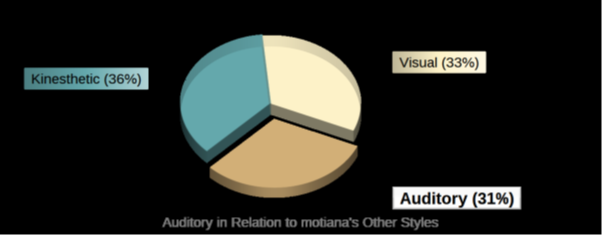

<h1>My Profile</h1>

<h2>Personal Intro</h2>

<h3>Name: Motiana Tusa</h3>

<h3>Student ID#: 3873180</h3>

<h3>Email: s3873180@student.rmit.edu.au</h3>

<h2>Background</h2>

I was born and raised in Western, Samoa a beautiful Polynesian island country in the heart of the
Pacific. Consisting of two main Islands called Upolu and Savai'i and other small inhabited ones
around it. Western Samoa is only a dot on the world map.
I am the 5th child of 7 children, my father passed on when I was 6yrs old and I had two other
siblings after me. My mother raised all seven of us by herself with some help of my extended
family every so often. I was married in Samoa and had my first son there before migrating to New
Zealand with my family in early 1984, where we had three of our other children. We lived there for
10yrs before moving to Australia in 1994.

I completed some courses in New Zealand that were relevant to different positions that I was
undertaking at the time, whilst raising my children and taking care of my family.

My highest studies were completed in Australia at Victoria University in 2012. They were
Advanced Diplomas in Community Sector Management and Disability (CertV1).

I speak both Samoan and English. I care for my 85yr old elderly Mum, and that is my number
one priority as in our culture, we take care of our parents till the end, we do not put them in
nursing homes.

I started in Disability in 2005 and am currently working in this field. People have always
commented on the quality of my performances, attention to detail and care giving abilities.
Collaborating well with all stake holders, administration duties and managing our workplace as a
whole. Noticing the fact that I get really frustrated when it comes to computer issues that I can't
fix immediately due to lack of knowledge and understanding and other times is purely the system
that has issues. When this happens, I don't want to leave the workplace till it's all sorted.

I guess that I am fortunate of my upbringing from my mum where she taught me that whatever I
do, it must be done well. And whatever I start, I must strive to completely finish it on the day.
Never leave what I can accomplish today for tomorrow, as tomorrow is unknown and it will always
bring new and possibly more things to do or learn. And that is exactly how I operate in my
everyday life, in which majority of the time is very beneficial. Some of the benefits are - that
feeling of accomplishments is very fulfilling and I always gain more time to catch up on other
things or just a relaxing day spend with my loved ones.

<h1>Interest in IT</h1>

What is your interest in IT?

I am fascinated with how beneficial technology is to the world in all levels of its existence.
From Arts to Businesses, Banking, Communications, Education, Health (Aid/Equipments) Internet,
Science, Transport to name a few. I am excited and have taken these studies to learn and acquire
more knowledge about IT so to make an informed decision for my next career path. Everything is
possible, in reach, fast and convenient at a touch of a button. Technology still depend on human
faculties for its smooth operational.

When did your interest in IT start?

My interest in IT started from years ago but was not able to pursue studies at the time due to
family responsibilities but now I can. One of my niece is in Graphic designing doing extremely well
has been nagging me for years to study IT but the timing was not right then.
Also my work when our computer system always have issues that none of us staff know how to
fix it. I always have to call an IT expert to come to our aid and help fix the problem. At times, the
IT was not able to solve the problem and this has to be passed onto the next level and then
waited and this can be from a few hours or even a day or two. These ongoing issues always limits
productivity, waste valuable time and unable to meet deadlines.

Was there a particular event or person that sparked your interest? Outline your IT
experience (if any).

I have friends that are currently working in IT and they always encouraged me to take it up and I
am now ready to pursue it. I was also advised by some IT professionals that I interacted with
through my work to take it on. The other important thing is that I need to look after my health in
minimising the physical strain to my body. Therefore, with everything considered, IT suits me more
and is the ideal way to continue the work life balance.

Why did you choose to come to RMIT?

I have some family members and friends that studied with RMIT who recommended it to me. I
also did some research on RMIT's reputations, success rates and feedbacks. And also great to
learn that courses are offered locally and nationally. The student success on offer to help and
support students to achieve and succeed is amazing. That really shows that RMIT really cares
about delivering the high quality of learning strategies to all students to acquire and develop
further. I can see that this will not only benefit individuals on a personal level but building teams,
organisations and humanity globally. RMIT's vision is broadly worldwide.

What do you expect to learn during your studies?

My expectations is to strive to do well in this entry level of IT, then continue my studies and be
familiar with all different sectors of IT industry as this will help me identify where my passion lies
then work towards it.

Learning online for the first time is quite challenging for me but striving to do well as an individual
for own personal growth and development and to collaborate well in a team environment with
other students and tutors to achieve our common goals. Also building respectful relationships
towards everyone and everything will make learning enjoyable and easier and master IT
leadership skills and strategies in preparations for future achievements.

 

<h1>Ideal Job</h1>

Find an advertisement showing what you believe to be your ideal job. This may require
several years of experience, and hence be something that you must work towards, rather
than something that you are ready for now, or will be able to fill as soon as you graduate.
There are various ways to search for IT jobs, including websites like {seek.com.au}. You
should include the following information. 

The job advertisement itself. Include a link, and a snapshot of it (in case the link expires
before the assignment deadline). 

https://www.linkedin.com/jobs/view/1931291520/

• A description (own words) of the position, and particularly

The position is a coordination role to support other scrum masters, plan higher level initiatives.
Managing the tribe of scrum masters to manage their teams more effectively, as well as manage
my own scrum team.

• What makes this position appealing to you.

This position is ideal for me as I have vast experience in management, and this role applied
management in the app development space. Noticing that I have some of the quality
requirements such as management and leadership skills and communications skills that will help
in supporting a team to excel.

• A description (own words) of the skills, qualifications and experience required for the
position.

The position requires someone with a wealth of knowledge, skills and experience to oversee,
facilitate, manage and be part of a diverse team. The candidate must be able to collaborate and
communicate at all levels with professionalism and integrity in the space of app development.
Consulting and reporting directly to the Program Director using best practices to deliver high
quality of service to achieve successful outcomes.

• A plan describing how you will obtain the skills, qualifications and experience required for
the position, building on those you have now.

1. Get a degree in IT and learn the app development cycle

A. Learn all the technology development process & principles

B. Learn all the methods for managing teams in tech

2. Get Scrum Master certification

3. Get first job as a scrum master

<h1>Personal Profile</h1>

<h2>Test 1 - Personality</h2>

www.16personalities.com

ENFJ
A Protagonist (ENFJ) is a person with the Extraverted, Intuitive, Feeling, and Judging
personality traits. These warm, forthright types love helping others, and they tend to have
strong ideas and values. They back their perspective with the creative energy to achieve
their goals.

Now that you have hopefully had a chance to read the overview of your Protagonist personality
type, we would like to share some additional insights revealed by our studies. We hope you will
find them fun, interesting and perhaps both unexpected and strangely familiar.
Our research shows that Protagonists are the most likely personality type to...

• actively volunteer;

• say they are more optimistic than pessimistic;

• be able to tell how someone is feeling just by hearing their voice;

• go out of their way to find environmentally friendly brands when shopping;

• believe in karma;

• like reviewing old photos;

• remember most of their dreams;

• enjoy mentoring other people;

• love giving gifts;

• be highly motivated and energetic most of the time;

• enjoy keeping others up-to-date on their life;

• consider themselves very spiritual;

• be good at de-escalating situations where people are becoming hostile;

• take great care to sustain a healthy lifestyle;

• believe that everything happens for a reason.

Can you see yourself in some of these statements? Got any stories to share? Please do so by
responding to this e-mail – we would love to hear from you.

In the next e-mail, we will talk more about what tools and resources our website can offer you.
Our mission is to help you understand yourself better and use that knowledge to navigate the
world – knowing why you and people in your life do things in a certain way can really spur your
personal growth and make you a much happier and more well-rounded person.

<h1>Test 2 - Learning styles</h1>

https://personalitymax.com

Discover how you learn by hearing, seeing and doing.

Learning Styles is a theory that suggests people learn better using different methods of learning.
We perceive information using our senses. The three most practical senses in learning
environments are sight, hearing and touch. The VAK model categorises these sensory methods of
learning as Visual (V), Auditory (A) and Kinesthetic (K) learning styles.

While most people have a dominant learning style, nobody has just one learning style. Everyone
uses each of the learning styles to some degree. Some are stronger in one style while others have
even strength in all styles. The reality is that we all have a custom "learning style" that is, in varying
degrees, a combination of Visual, Auditory and Kinesthetic learning.

It is useful to know the strength of your learning styles as they relate to each other. This allows you
to focus on maximising your learning potential. Recognising your strengths also helps you to seek
learning opportunities that cater to your combination of learning style strengths. In recent years,
many educators have started using knowledge of Learning Styles (and Multiple Intelligences) to
improve teaching methods in order to reach learners of all types

Kinesthetic Learning and You:

Kinesthetic style is learning by doing. You learn in this manner whenever you capture new
information through the process of physical activity. It is often referred to as a hands-on learning
experience.

Consider how you learned to ride a bicycle. You learned by getting on a bike to experience and
practice balancing, steering and pedaling. This experience ultimately taught you how to ride.

Characteristics of a Kinesthetic Learner

Good at learning through hands-on experiences

Often bored with traditional textbook learning

Likes to move around and explore their environment

Usually enjoys athletics and physical education

Likes to touch objects and people

Would rather participate than watch

Appreciates opportunities to go on field trips

Gets satisfaction from building with their hands

Enjoys classes with physical experiments

Can become restless without physical activity

<h1>Visual Learning and you</h1>

<h1>Visual is your secondary learning style.</h1>

Visual style is learning by seeing. You learn visually whenever you gain information from sight. This
includes more than just the viewing of pictures and your surroundings. Visual learning also
encompasses the written word.

Visual learners benefit greatly from teaching that utilizes illustrations, charts, diagrams, videos, etc.
They often feel a need to convert spoken instruction into visual form by taking notes.

Characteristics of a Visual Learner:

Good at remembering people's faces

Accurately recognises body language and facial expressions

Able to picture things in their mind

Good at taking notes in the form of text and doodle

Comprehends visual information such as charts, graphs and diagrams

Recalls appearances with ease

Appreciates pictures and illustrations in books

Enjoys learning from video presentations

Learns well from flash cards

Notices visual details that others might miss

<h1>Auditory Learning and You:</h1>

Auditory is your least preferred learning style.

Auditory style is learning by hearing. This type of learning is helpful in the classroom environment.
During a lecture, an auditory learner is able to easily comprehend, process and retain information.

Auditory learning is not only the ability to listen to spoken word and interpret tone, but to do so with
a high level of accuracy and efficiency. Learners with strong auditory ability are able to hear and
comprehend without missing much.

Characteristics of a Auditory Learner

Good at remembering people's name's

Recalls spoken information with ease

Aware of and easily distracted by sounds

Enjoys listening to audio books and storytelling

Often skilled at speaking

Prefers classes in lecture format

May record lectures to hear again later

Benefits from reading out loud

Enjoys rhymes and rhythmic pattern in language

Benefits from group discussions

<h1>Test 3 - Creativity</h1>

Abstraction, Connection, Perspective, Curiosity, Boldness, Paradox, Complexity, Persistence, You
(71.31), Typical (63.09)

Explanation of different metrics

Abstraction The ability to abstract concepts from ideas

Connection The ability to make connections between things that don't initially have an
apparent connection

Perspective The ability to shift ones perspective on a situation - in terms of space and
time, and other people

Curiosity The desire to change or improve things that everyone else accepts as the norm
Boldness The confidence to push boundaries beyond accepted conventions. Also the
ability to eliminate fear of what others think of you

Paradox The ability to simultaneously accept and work with statements that are
contradictory

Complexity The ability to carry large quantities of information and be able to manipulate
and manage the relationships between such information

Persistence The ability to force oneself to keep trying to derive more and stronger
solutions even when good ones have already been generated

What do the results of these tests mean for you?

The results of the three tests shown above have summed up some attributes of my own character
which I value both personally and professionally.
They show that I am genuine and caring, that I am hands-on and lead from the front and can be
creative.

How do you think these results may influence your behaviour in a team?

The test results show that my behaviour can be beneficial in a team environment, given that I
adopt the correct leadership style.

How should you take this into account when forming a team?

A successful and productive team is based on leadership, direction and common goals. When
forming a team it is good to have cohesion between its members, as I have the tendency to be
hands-on, creative and caring - it would be beneficial to recruit like-minded team members, also
taking into consideration the need for new ideas and dynamism.

<h1>Project Idea</h1>

<h2>Overview</h2>

The project involves the creation of an application for iPhone and Android that teaches virtues to
build moral character with the target audience being children and youth. This app will be created
using Appery.io and will be based on "The Virtues Project" by Linda Kavelin Popov. It will allow
users to create an account and allow for them to explore various subjects to help build character
based on virtues. It will have features such as "Virtue of the Week" and famous and inspiring
quotes from notable historic figures. There will also be mini-games such as a word search,
crosswords and quizzes etc. Users will be able to communicate with friends and track their
progress as they make their way through the various moral dilemmas aimed at developing
character.

<h2>Motivation:</h2>

My motivation for creating this application is to provide a resource for young children and
adolescents to use to help build and strengthen moral character.
There have been some alarming incidents involving children and youth in the media recently,
particularly and I believe with the creation of an app targeted towards this demographic in relation
to virtues (e.g. assertiveness, confidence, courtesy etc.) will help young people make better
choices, when faced with a difficult or challenging situation.

<h2>Description:</h2>

The project involves the creation of an application for iOS and Android that teaches virtues to
build moral character with the target audience being children and youth, this is to address the
alarming number of incidents among young people with the law, their daily activities, their
lifestyles and assist with their decision making.
The app will be created using Appery.io and will be based on "The Virtues Project" by Linda
Kavelin Popov. www.jalmarpress@att.net. www.jalmarpress.com. It will allow users to create an
account and allow for them to explore various subjects to help build character based on virtues to
bring about the best within.

It will have features such as "Virtue of the Week" and inspirational quotes from notable figures and
role models in the community (sports stars, community leaders etc.). Users will be able to add
"friends" and communicate with them and track their progress as they make their way through
various moral dilemmas, which they can select from the menu, aimed at developing character, this
will also include mini-games such as a word search, crosswords and quizzes etc. - the difficulty
will scale with progress and completion of more simple virtue based activities leading to higher
levels of difficulty, which will reinforce the need for virtue based decision making.

This will also support the children and youth to be more conscious and aware when face with
unpleasant or challenging situation in the community or at home and not to be influence in a
negative ways that can lead to other concerning issues with harsh consequences.
If it all goes well, then the outcome will be magnificently beneficial for them, their families, friends
and the whole community.
With more young people owning or having access to a mobile phone, now more than ever, it will
be easily accessible.

<h2>Technologies</h2>

As already stated the UI will be created using Appery.io platform, a cloud based mobile app
builder - It has simple template based and drag and drop UI design, which can be used to build a
database based on the "The Virtues Project". As it is cloud based the use of a laptop or even a
mobile phone is possible for creation of the app. This however, is not open source and does come
at a cost ($135/month for Team development) but allows for collaboration in real-time.

<h2>Skills Required</h2>

Skills required for the creation of the app are minimal given the ease of use of the Appery.io
platform. The drag and drop feature allows for code to be auto-generated, basic knowledge of
laptop and/or mobile phone use to access the platform is required. Also, when collaborating in a
team then communicating over any of the video based apps, as well as, Appery itself in real-time
will assist with its creation.

<h2>Outcome</h2>

The main aim of this project is to improve the lives of one the most vulnerable groups of our
community. If it all goes well, it will benefit society as a whole as there will hopefully be more
young people equipped with character based values that will assist them in their decision making
process.
This may then have an impact on the number of incidents and crime-related activities that some
of our young people may find themselves involved in - hopefully a reduction in the frequency and
a better society as a whole.

<h1>References</h1>

www.16personalities.com

https://personalitymax.com/report/?ls=77-72-85&name_key=bd0fcd6e64

http://www.testmycreativity.com/share/732a88222F5E Your creativity score is 71.31

www.jalmarpress@att.net. www.jalmarpress.com

